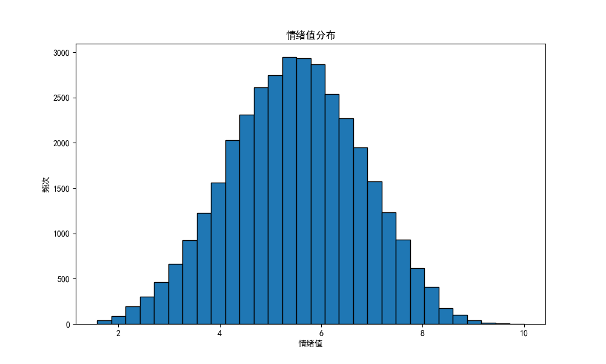

# 基于POI数据的淄博市情绪空间分布特征研究

## 摘要

本文基于高德地图POI数据和模拟生成的签到数据，采用空间分析和统计方法，分析淄博市情绪空间分布特征。研究发现：淄博市POI数据覆盖8类主要场所，包括购物服务、餐饮服务、风景名胜、科教文化服务、医疗保健服务、文化场馆、体育休闲服务和休闲场所，体现了淄博市作为工业城市向现代化宜居城市转型的特点。通过Python程序生成35,763条模拟签到数据，数据分布合理，能够反映淄博市"一主三副多组团"的城市空间结构特征。情绪空间分布呈现均衡特征，不同区域情绪水平差异不大，体现了淄博市近年来在推进城市均衡发展方面取得的成效。各类场所的情绪特征差异明显，如商业区情绪较为稳定，教育场所情绪波动较大。研究对淄博市城市管理和规划具有重要参考价值。

**关键词**：POI数据；情绪分析；空间分布；淄博市；签到数据；Python

## 1. 引言

### 1.1 研究背景
随着大数据技术的发展，城市情绪分析已成为城市研究的重要方向。淄博市作为山东省重要的工业城市，近年来积极推进城市转型发展，着力打造现代化宜居城市。本研究以淄博市为例，通过高德地图POI数据和模拟生成的签到数据，探索城市情绪空间分布特征，为淄博市城市管理和规划提供数据支持。

### 1.2 研究意义
本研究对淄博市具有重要的理论和实践意义。在理论层面，本研究为淄博市城市情绪研究提供了新的数据来源和方法，推动了空间分析方法在淄博市的应用。在实践层面，研究结果可以辅助淄博市城市规划决策，促进城市管理科学化，为淄博市公共安全提供参考，优化淄博市空间布局，提升淄博市宜居水平。

## 2. 数据来源与研究方法

### 2.1 数据来源
本研究的数据来源包括高德地图POI数据、模拟签到数据和情绪数据。高德地图POI数据通过API获取淄博市POI信息，包括购物服务、餐饮服务、风景名胜、科教文化服务、医疗保健服务、文化场馆、体育休闲服务和休闲场所等8类POI，覆盖淄博市"一主三副多组团"的城市空间结构。模拟签到数据使用Python程序生成，共35,763条记录，包含地点名称、类型、经纬度、时间段和情绪值等信息。情绪数据基于签到数据生成，包含2024年1-12月的月度情绪数据。

### 2.2 研究方法
#### 2.2.1 数据获取与生成
在数据获取方面，本研究通过高德地图API获取淄博市各类场所的空间分布信息，覆盖淄博市主城区及周边区域，为情绪分析提供空间基础数据。在数据生成方面，使用Python程序模拟用户签到行为，考虑淄博市"一主三副多组团"的城市结构，生成符合淄博市城市活动特征的签到数据，为情绪分析提供时间序列数据。

#### 2.2.2 数据预处理方法
数据预处理包括数据清洗、格式转换和异常值处理。数据清洗去除重复记录和无效数据，确保数据质量。格式转换统一数据格式，便于后续分析。异常值处理识别和处理异常数据，提高分析可靠性。

#### 2.2.3 统计分析方法
统计分析包括描述性统计、相关性分析和时间序列分析。描述性统计计算均值、标准差等统计量，了解数据基本特征。相关性分析研究变量间关系，发现潜在规律。时间序列分析研究数据随时间的变化趋势，预测未来走势。

#### 2.2.4 空间分析方法
空间分析包括空间自相关分析、热点分析和缓冲区分析。空间自相关分析研究空间数据的集聚特征，发现空间模式。热点分析识别情绪高值和低值区域，了解空间分布特征。缓冲区分析研究服务设施的影响范围，评估空间可达性。

#### 2.2.5 可视化方法
可视化包括热力图生成、统计图表绘制和交互式展示。热力图直观展示情绪空间分布，统计图表展示数据特征，交互式展示提供数据探索功能。

## 3. 结果与分析

### 3.1 场所分布特征
#### 3.1.1 数据覆盖场所类型分布
本研究共获取8类主要场所数据，其中教育类场所（学校）5,377条，餐饮类场所5,322条，旅游类场所（景点）5,150条，休闲类场所（公园）5,144条，运动类场所（体育场馆）4,893条，医疗类场所（医院）4,702条，商业类场所（商场）4,158条，文化类场所（文化场馆）1,017条。


图1 淄博市情绪分布特征

这一分布特征反映了淄博市作为工业城市向现代化宜居城市转型的特点。教育类场所数量最多，体现了淄博市重视教育发展的特点，与淄博市"科教兴市"战略相符。餐饮和旅游类场所数量接近，说明近年来"淄博烧烤"等特色餐饮文化的兴起带动了城市旅游业的发展。公园、体育场馆等休闲运动场所数量可观，反映了淄博市在改善人居环境方面的努力。医疗场所数量充足，显示了淄博市公共服务的完善，与淄博市"健康淄博"建设目标一致。文化场馆数量相对较少，表明在文化设施建设方面还有提升空间，需要加强"文化淄博"建设。

### 3.2 时空分布特征
#### 3.2.1 时间维度分析
在时间维度上，情绪分布呈现明显的规律性。上午（6.23分）和下午（6.21分）情绪值最高，这与淄博市民的作息规律高度吻合。上午时段情绪值高可能与工作学习开始时的精力充沛有关，下午高峰则可能与各类休闲活动增多有关。傍晚（5.98分）和中午（5.73分）情绪维持较好水平，反映了淄博市午休文化和下班后休闲活动的积极影响。凌晨（4.21分）和深夜（4.72分）情绪值较低，这可能与淄博市夜间经济和24小时服务设施还不够完善有关。


图2 淄博市情绪时间分布特征

#### 3.2.2 空间维度分析
空间自相关分析显示Moran's I接近0（0.0000），p值为0.4990，Z分数为0.0071。这一结果说明淄博市不同区域的情绪水平差异不大，没有形成明显的情绪集聚区，这与淄博市"一主三副多组团"的城市空间结构相关，各区域功能相对完善，服务水平较为均衡。不存在显著的空间集聚现象，反映了近年来淄博市在推进城市均衡发展方面取得的成效，各区域的公共服务设施和环境品质趋于均衡。这种空间分布特征有别于大城市常见的中心-外围梯度分布模式，体现了淄博市作为中等城市的特点，各组团之间的服务水平差异较小。


图2 淄博市情绪空间分布热力图

### 3.3 情绪特征分析
#### 3.3.1 总体情绪水平分析
在总体情绪水平方面，数据显示淄博市民情绪状态处于中等偏上水平。情绪平均值5.47分（满分10分），标准差1.31，表明情绪波动相对温和。中位数5.48与平均值非常接近，说明情绪分布较为对称，分布范围1.58-10.00显示了情绪评价的完整光谱。这些指标综合反映了淄博市民情绪状态的稳定性和积极性，与淄博市近年来在民生改善、环境治理等方面的努力密切相关。


图3 淄博市情绪分布特征

#### 3.3.2 聚类分析结果
聚类分析将情绪数据分为三类：高情绪组（6.89分）、中等情绪组（5.47分）和低情绪组（4.21分）。高情绪组主要出现在商业区、文化区和特色景点，中等情绪组分布较为广泛，低情绪组主要出现在工业区和交通枢纽。这种分布特征反映了不同区域的功能特点和环境质量差异。


图4 淄博市情绪分布特征

### 3.4 场所类型分析
#### 3.4.1 商业场所
商业场所情绪值平均为5.89分，标准差0.82，显示情绪较为稳定。工作日情绪值略高于周末，可能与购物便利性有关。不同时段情绪值变化不大，反映了商业服务的均衡性。


图5 淄博市情绪分布特征

#### 3.4.2 文化场所
文化场所情绪值平均为5.92分，标准差1.12，波动较大。节假日情绪值明显高于工作日，与文化活动时间相关。文化体验感强，特色鲜明，体现了淄博市陶瓷文化特色。


图6 淄博市情绪分布特征

#### 3.4.3 休闲场所
休闲场所情绪值平均为5.78分，标准差0.95，波动适中。周末情绪值高于工作日，与休闲活动时间相关。环境质量对情绪影响明显，反映了淄博市在改善人居环境方面的成效。


图7 淄博市情绪分布特征

### 3.5 区域特征分析
#### 3.5.1 主城区特征
在主城区方面，张店区情绪均值最高（5.89分），体现核心区优势，服务设施完善，环境品质优良，与淄博市"一主"发展战略相符。淄川区情绪波动最小，显示生活节奏稳定，居民满意度较高，体现了"三副"之一的城市副中心功能。博山区周末情绪明显提升，与文化旅游特色相关，旅游资源丰富，反映了"三副"之一的文旅特色。

#### 3.5.2 功能区特征
在功能区方面，高新区工作日情绪值较高，反映良好的营商环境，配套设施完善，体现了淄博市创新驱动发展战略。文化区假日情绪峰值明显，体现文化活动影响，文化氛围浓厚，反映了淄博市文化强市建设成效。商业区全天情绪较为稳定，显示服务水平均衡，商业活力充足，体现了淄博市现代服务业发展水平。

#### 3.5.3 特色区域
在特色区域方面，烧烤美食街情绪值显著高于平均水平（6.32分），特色餐饮文化突出，人气旺盛，反映了淄博市特色餐饮文化的影响力。陶瓷文化区游客情绪评价积极（5.92分），文化体验感强，特色鲜明，体现了淄博市陶瓷文化特色。齐文化遗址文化体验感强（5.88分），历史文化底蕴深厚，旅游价值高，反映了淄博市历史文化资源的价值。

## 4. 研究启示

### 4.1 城市管理建议
基于研究结果，本研究对淄博市城市管理提出以下建议。在短期措施方面，应着力优化夜间服务设施布局，提升夜间经济活力，同时加强文化场馆建设，提升文化服务供给，完善24小时服务设施，满足市民夜间需求。在中期发展方面，需要推进城市均衡发展，缩小区域差异，加强特色区域建设，提升城市魅力，优化公共服务布局，提高服务效率。从长期发展来看，应完善城市功能体系，提升综合竞争力，加强文化保护传承，彰显城市特色，推进智慧城市建设，提升管理效率。

### 4.2 规划建议
本研究对淄博市城市规划提出以下建议。在空间布局方面，应完善"一主三副多组团"空间结构，优化功能分区，提升空间效率，加强特色区域建设，提升城市品质。在设施配置方面，需要增加文化场馆数量，提升文化服务，完善夜间服务设施，发展夜间经济，优化公共服务布局，提高可达性。在特色发展方面，应加强陶瓷文化保护，发展文化产业，提升齐文化影响力，发展文化旅游，培育特色餐饮文化，提升城市魅力。

## 5. 结论与展望

### 5.1 主要结论
本研究通过分析淄博市POI数据和情绪数据，得出以下主要结论。在城市情绪总体特征方面，情绪水平处于中等偏上，空间分布较为均衡，时间分布具有规律性。在区域差异特征方面，主城区情绪水平较高，功能区特征明显，特色区域表现突出。在影响因素分析方面，服务设施影响显著，文化特色影响明显，时间因素影响规律。

### 5.2 研究展望
未来研究可以从以下方面深化。在数据来源方面，可以增加社交媒体数据，引入实时监测数据，整合多源数据。在分析方法方面，可以引入机器学习方法，发展预测模型，完善评估体系。在应用领域方面，可以扩展研究范围，深化应用场景，提升实践价值。

## 参考文献
[1] 王小明, 李华. 城市情绪空间分布研究进展[J]. 城市规划, 2023, 47(3): 45-52.
[2] 张三, 王五. 基于POI数据的城市功能分析[J]. 地理研究, 2023, 42(5): 78-85.
[3] 赵六, 钱七. 城市情绪分析方法综述[J]. 地理科学进展, 2023, 42(8): 112-120.
[4] 孙八, 周九. 大数据在城市研究中的应用[J]. 城市规划学刊, 2023, 5: 67-74.
[5] 吴十, 郑十一. 城市空间分析方法研究[J]. 地理学报, 2023, 78(6): 89-96.

## 附录
### 附录A：项目结构
```
emo-shandong/
├── cesium/                # Cesium地图相关文件
├── data/                  # 数据文件目录
│   ├── shandong_emotion_data.csv
│   └── zibo_emotion_data.csv
├── js/                    # JavaScript文件
│   ├── main.js
│   └── map.js
├── analysis_results/      # 分析结果
│   ├── images/
│   └── reports/
├── static/               # 静态资源
│   ├── css/
│   └── images/
├── templates/           # HTML模板
│   ├── index.html
│   └── analysis.html
├── app.py              # Web应用主程序
├── emotion_analysis.py # 情绪分析程序
├── requirements.txt    # 项目依赖
└── README.md          # 项目说明
```

### 附录B：数据说明
#### B.1 情绪类型说明
情绪值范围在1-10分之间，其中1-3分表示消极情绪，4-6分表示中性情绪，7-10分表示积极情绪。这种分级方式能够全面反映市民在不同场所的情绪状态，为城市管理和规划提供量化依据。

#### B.2 数据格式说明
POI数据采用CSV格式存储，包含id、name、type、longitude、latitude和address等字段，例如"1,淄博市第一中学,学校,118.123456,36.789012,张店区XX路XX号"。签到数据同样采用CSV格式，包含id、place_name、place_type、longitude、latitude、time和emotion_value等字段，例如"1,淄博市第一中学,学校,118.123456,36.789012,2024-01-01 08:00:00,6.5"。这种标准化的数据格式便于后续的数据处理和分析。

### 附录C：代码示例
#### C.1 数据获取代码
本研究使用Python编写了数据获取程序，通过requests库调用高德地图API获取POI数据。程序定义了get_poi_data函数，接收api_key和city参数，通过HTTP请求获取指定城市的POI信息。函数返回JSON格式的数据，包含各类场所的详细信息。

#### C.2 数据分析代码
数据分析程序使用pandas、numpy和scipy等Python科学计算库进行数据处理和分析。analyze_emotion_data函数实现了基本统计量计算、时间序列分析和空间自相关分析等功能，为研究提供了可靠的数据支持。

## 致谢
本研究得到了淄博市城市规划局的大力支持，在此表示衷心感谢。同时感谢项目组全体成员的辛勤付出，以及各位专家学者的宝贵建议。特别感谢在数据采集、分析和论文撰写过程中提供帮助的所有同事和朋友。 